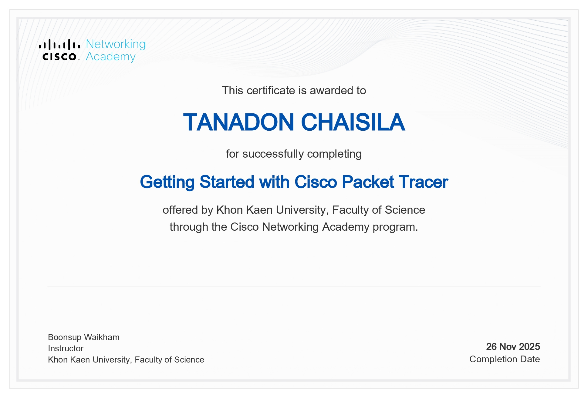

# Personal Portfolio — Network & Systems 2025–2026

---

## Assignments

| # | ชื่องาน| ไฟล์ / ลิงก์ |
|---|---------|--------------|
| 01 | Essay Link | [View](./assignments/Assignment1.pdf) |
| 02 | Topology | [View](./assignments/Assignment2.pdf) |
| 03 | Not_Simple | [View](./assignments/Assignment3.pdf) |
| 04 | TCP-UDP | [View](./assignments/Assignment4.pdf) |
| 05 | New Network | [View](./assignments/New_Network.pdf) |

---

## Lab Reports

| # | ชื่อ Lab | ไฟล์ / ลิงก์ |
|---|----------|--------------|
| LAB 1 | Lab Report 1 | [View](./labs/Lab1.pdf) |
| LAB 2 | Lab Report 2 | [View](./labs/Lab2.pdf) |
| LAB 3 | Lab Report 3 | [View](./labs/Lab3.pdf) |
| LAB 4 | Lab Report 4 | [View](./labs/lab4.pdf) |
| LAB 5 | Lab Report 5 | [View](./labs/lab5.pdf) |
| LAB 6 | Lab Report 6 | [View](./labs/lab6.pdf) |
| LAB 7 | Lab Report 7 | [View](./labs/lab7.pdf) |

---

## Final Project

| ชื่อ | ไฟล์ / ลิงก์ |
|------|--------------|
| Final Project Artifacts | [View](https://github.com/tanadoncha-bit/The-Living-Existence-Network-LEN-Architecture) |

---

## Certificate Gallery
<table>
  <tr>
    <td align="center" width="50%">
      
    </td>
  </tr>
</table>

---

  Network & Systems Portfolio · 2025–2026

